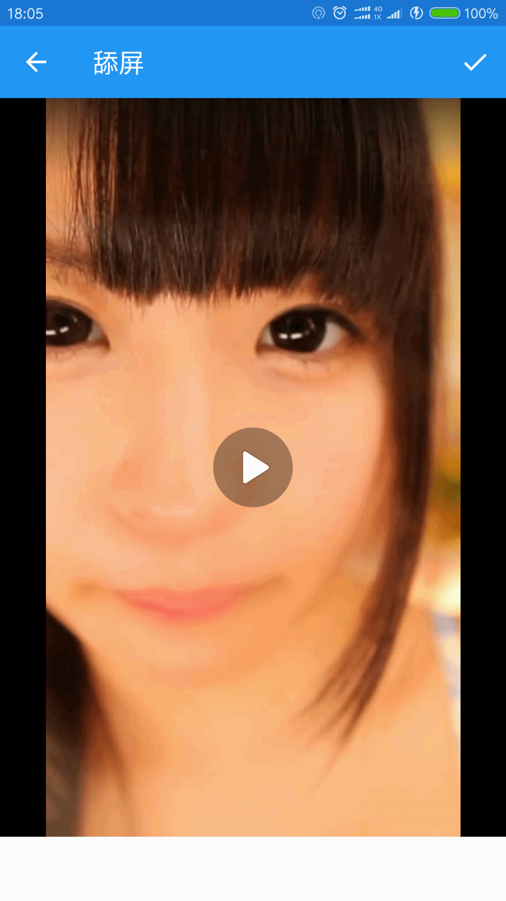

# Video LiveWallpaper
使用视频作为壁纸。使用leancloud作为后端云存储视频
##使用一段视频来作为壁纸  
可以添加一个文件选择器来选择视频文件来作为壁纸
 ## 特性
 * 使用kotlin开发
 * 可以预览视频,下载视频,设置壁纸
 * 打开本地视频
 * 现拍视频,现用
 ##使用
 直接下载源码，导入android studio。 添加IAP里面的leancloud的key
 ```
 AVOSCloud.initialize(this, "appkey", "clientkey")
 ```
 ## 展示
 





